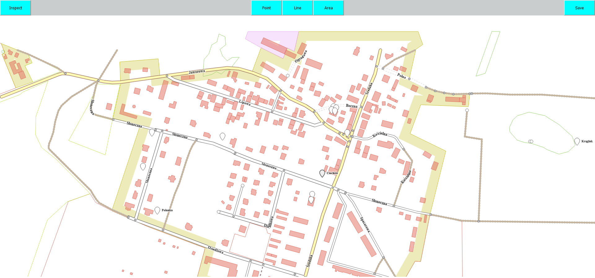

# digital-map-editor

> Project was inspired by open-source project called UMP, which deals with a free map for users. The application that I decided to built is a graphical user interface for a mocked-up digital map editor. Code of the application in this repository is part of my master thesis called "Comparative performance analysis of front-end frameworks applied to digital map editor", it represents React part of the project, that also consists of Angular and Vue applications.<br/>
> \*\*Live demo here https://digital-map-editor.web.app/.

## Table of Contents

- [Technologies Used](#technologies-used)
- [Features](#features)
- [Screenshots](#screenshots)
- [Setup](#setup)
- [Copyright claims](#copyright-claims)

## Technologies Used

- React - version 17.0.1

## Features

The application allows a user to perform actions specified below.

### List of the features:

- Adding objects
- Editing objects
- Editing attributes
- Map overview

## Screenshots



## Setup

### Requirements for development of the project:

- Node.js - version 16.13.1
- npm - version 7.6.3

1. Clone repository from github
2. Install all dependencies.

```bash
  npm install
```

3. Start the server and application.

```bash
  npm start
```

## Copyright claims

Items used in this project belong to their creators/authors and are not claimed by author of this project and people that use it.
